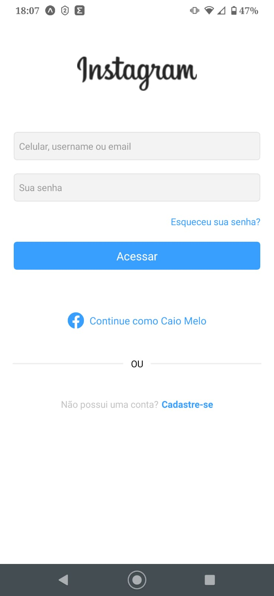

# Clone da Tela Inicial do Instagram

Olá, pessoal! Este é um projeto de clone da tela inicial do Instagram que desenvolvi com o React Native. Aqui, vou compartilhar minha jornada de criação dessa versão própria da interface que todos nós conhecemos e adoramos que se chama Instagram.

## Objetivo do Projeto ( O que eu aprendi ) 

Nesta aventura de desenvolvimento, aprendi várias coisas legais:

- Criando a Magia : Tive a oportunidade de recriar elementos como campos de login, botões e até mesmo a opção de fazer login com o Facebook, trazendo a experiência do Instagram para a vida.

- Domínio do React Native : Mergulhei de cabeça no mundo do React Native, aprendendo a criar interfaces de usuários móveis incríveis.

- Estilo é Tudo : Usei ou StyleSheet para adicionar um toque de estilo à interface do usuário, tornando-a visualmente atraente.

- Compatibilidade Total : Tornei o projeto responsivo, garantindo que ele funcione bem em diferentes tamanhos de tela e plataformas.

- Interatividade com Toque : Adicionei interatividade com eventos de toque e criei uma experiência de usuário com envolvente TouchableOpacity.

- Brilho com Imagens e Ícones : Dei vida ao projeto com imagens cativantes e ícones incríveis do pacote @expo/vector-icons.

- Lidando com o Teclado Virtual : Aprenda a lidar com o teclado virtual para garantir uma experiência de usuário sem problemas.
##
 - Uso de componentes do React Native.
 - Estilização de componentes usando `StyleSheet`.
 - Layout responsivo para diferentes tamanhos de tela e plataformas.
 - Tratamento de eventos de toque.
 - Uso de imagens e ícones.
 - Manipulação do teclado virtual.
 - Organização e estrutura de componentes.
 - Prática com `TouchableOpacity` e `TouchableNativeFeedback`.
 - Uso de cores e tipografia para uma aparência coesa.
 - Conexão entre componentes (embora este projeto se concentre na interface do usuário).

##

# 👥 Confira:

### Processo de Geração de Senha

<ul style="list-style-type:none; display:flex; justify-content:space-between;">
  <li>
    
  </li>
</ul>

## O Mestre por Trás da Magia

Eu sou o criador apaixonado deste projeto. Se você quiser me conhecer melhor ou verificar meus outros trabalhos, confira meu perfil no GitHub.
